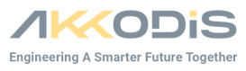

# AMAD - AKKODIS MDAO Aircraft Demonstrator ✈︎
`AMAD` is a multidisciplinary design analysis and optimization (MDAO) tool kit for aircraft optimization.
The initial version covers a conventional aircraft example.
The optimization and multidsisciplinary approach is based on the [CoSApp](https://gitlab.com/cosapp/cosapp) environment.
## Implemented Disciplines
- Aircraft Geometry
- Aerodynamics
- Aircraft Mass estimation (Raymer, Torenbeek)
- Turbofan Engine (Mattingly)
- Mission Performance
- Support Routines (ISA Atmosphere, Unit Conversions, etc.)

## External optional dependencies
- [AVL](https://web.mit.edu/drela/Public/web/avl) for aero computation
- [XFOIL](https://web.mit.edu/drela/Public/web/xfoil) for airfoil computation

## Included Python Packages
- AeroSandbox: https://github.com/peterdsharpe/AeroSandbox
- CoSApp: https://cosapp.readthedocs.io/en/latest/

## Example demo notebooks
Example and demo jupyter notebooks for different subjects are available in the `amad/demo/notebooks` folder.

## Contributors
Peter CAIRNS
  Rafael Rojas CARDENAS
  André HOCHSCHULZ

## Contact
amad@akkodis.com
